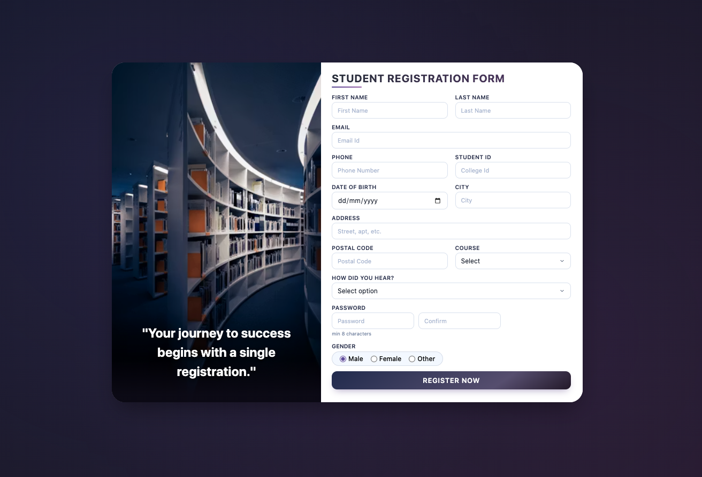

📘 Student Project

A simple frontend web project built using HTML, CSS, and JavaScript.

📁 Project Structure
.
├── index.html      
├── index.css    
├── index.js        
└── README.md      

🚀 Features

Clean and structured HTML layout
Styled using CSS
Interactive functionality with JavaScript
Beginner-friendly project structure

🛠️ Technologies Used

HTML5
CSS3
JavaScript (ES6)

▶️ How to Run the Project

Download or clone the repository
Open the project folder
Double-click on index.html
OR
Open it using Live Server in VS Code

📌 Purpose

This project is created for learning and practicing frontend development concepts. 

