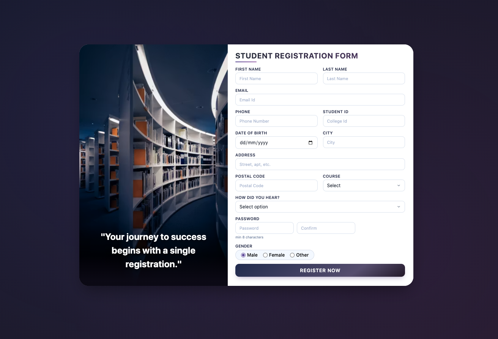

## 📘 Student Project

A simple frontend web project built using HTML, CSS, and JavaScript.

---

## 📁 Project Structure
.

├── index.html     
├── index.css      
├── index.js        
└── README.md       

---

## 🚀 Features

Clean and structured HTML layout

Styled using CSS

Interactive functionality with JavaScript

Beginner-friendly project structure

- Clean and structured HTML layout
- Styled using CSS
- Interactive functionality with JavaScript
- Beginner-friendly project structure

---

## 🛠️ Technologies Used

- HTML5
- CSS3
- JavaScript (ES6)

---

## ▶️ How to Run the Project

1. Download or clone the repository
2. Open the project folder
3. Double-click on `index.html`
**OR**
- Open it using **Live Server** in VS Code

---

## 📌 Purpose

This project is created for learning and practicing frontend development concepts. 

---

## 🌐 Live Demo

🔗 [View Project Live](https://priya-maurya-iphtech.github.io/Student-Registration-Form/)

---

## 

---
